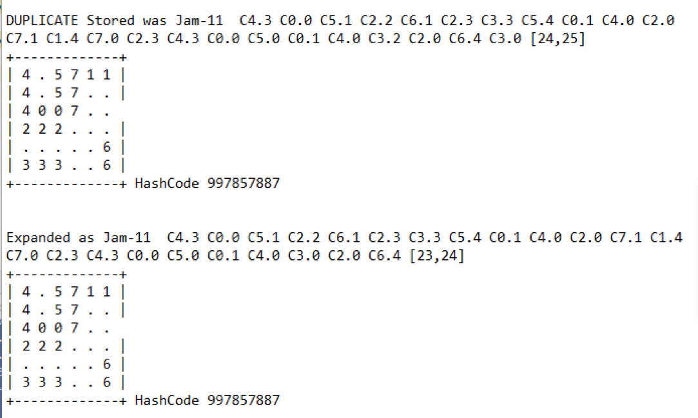

# ParkingLotRevisited

Program 3 Spring 2019
20 Points
Parking Lot Puzzle Revisited AVL Trees

### PART 1
You have been given the AVL tree code from your author as a starting point.  Reading code is a valuable experience.  On the job, you are often asked to modify/maintain existing code.  You can’t start over and do it your way.  You must incorporate your changes into the exisiting code. You are expected to understand the code that has been given to  you.  Make the following changes:
1.	Change all variable names to be meaningful names.  
2.	Make any changes needed to conform to our style guidelines, including better comments.
3.	Implement the  function deleteMin.   Remove the smallest node in the tree and rebalance.  This function  is to be your own work, not copied from ANY other source.  Note that doing a findMin followed by deleting that value will not work, because of duplicates.  Plus, you would learn nothing from that approach.
The data to be stored in the AVL tree is to be generic and work for either an Integer or an Object (of the puzzle variety).
Illustrate that the AVL tree is working properly by running the tests shown in the sample code.  The starter code includes a Dwarf class so you can see  how the code works with an object you create.  Do not skip this step!  Debugging on a simple example saves a ton of time!

### PART 2
Use the AVL tree as a priority queue to improve your solution to the puzzle problem (of program 1).  This is the idea.  Suppose instead of looking at solutions in the brute force order (which we used in program 1), what if you favored partial solutions which look closer?  For example, which of the following is the best?  Logically, it depends on the amount of work already done to get to this state and the anticipated remaining work.

A priority queue is a queue such that insertions are made in any order, but when you remove a node from the queue, it is the one with the best priority.  Our priority will be an estimation of the total amount of work needed to solve the problem – so a lower score is preferred.  Thus, we will first consider boards that “look better” to us.  This is not a greedy solution as we don’t pick the best and ignore the others.  We start with the best, but retain the others (as they may become the best in the future).  Simply stated, we still have the possibility of considering every possible move.  We just look at the most promising first.

In our previous solution, (program 1),  we considered all one-move solutions before considering all two move solutions, and so on.  If we are smarter in which solutions we consider, we can improve the functioning of the solution.  In this assignment, you will compare your previous solution to this new technique.

We will modify Node to contain  
•	depth (already there): number of moves taken from initial state to reach current board  
•	estimated number of remaining moves to reach a solution  
•	priority (depth + estimated number of remaining moves to reach a solution)  
•	The Node class will need to implement comparable in order to be used with the AVL tree code.  

Best-first search. Our solution illustrates a general artificial intelligence methodology known as the A* search algorithm. 
First, insert the initial state into a priority queue. Then, select from the priority queue the state with the smallest priority.  From this node, insert onto the priority queue all neighboring states (those that can be reached in one more move) using an appropriate estimated cost for each. Repeat this procedure until the state removed from the priority queue is the goal state. The success of this approach hinges on the choice of estimated cost or priority function.  Note how similar it is to the brute force solution.  The only difference is the type of queue that is used.
You can compute your “expected work function” any way you want as long it is reasonable and underestimates the real cost. Be creative. Here is a simple choice
Hamming distance: The number of cars blocking our exit. Intuitively, a search node with a small number of cars blocking is close to the goal.
We make a key observation: to solve the puzzle from a given state on the priority queue, the total number of moves required (including those already made) is at least its priority, using our distance function. 
Consequently, as soon as we dequeue a board which has the goal state, we have not only discovered a sequence of moves from the initial board to the board associated with the state, but one that makes the fewest number of moves. When we dequeue, we know everything else we will enqueue in the future will take at least as many moves to reach the goal.  This is true because our distance is an UNDER-estimate of the number of moves required.

### PART 3

Use Java’s build-in Hash Function to make sure you never revisit a state that is already on your priority queue.  The only catch is that you can’t discard a state if it is better than a previously enqueued equivalent state.    I had convinced myself that it wouldn’t happen, but I was wrong.  See NOTES below if you want a better explanation.  
The take away is:  
a.	If you generate a state that hasn’t been reached, put it on the priority queue.  
b.	If you generate a state that you have already put on the queue, but you reach the state quicker, put it on the priority queue.  
c.	Otherwise,  you can discard the duplicate state.  

Output:
Since we want to compare this version with our brute force solution in program 1, you will need to have both methods working.    Modify Puzzle to call either “solve” or “aStarSolve” on the same board.  Each method should keep track of the total number of states that were put on the queue.

1.	Show the output from both methods  for the first six puzzles in jamAll.txt.

2.	Highlight an example for which your “more intelligent” method saves significant time over the brute force method of program 1.  

3.	Use your “more intelligent” method to solve all the problems in jamAll.txt.  Just show the history, the final board, and the number of states put on the queue.

Hints
During debug, when using the A* search, show each board as you pull it off the queue.  Be sure to print all the data in the board state  (history, priority, expected moves remaining). 
What to Turn in: 
Submit a zip file containing your src folder.  

NOTES:  Here is an example of how the same state can be reached later, but be better than a previously reached duplicate.  The first item was already on the queue when the second is generated.  This happened enough for Jam-11 that my solution was three moves longer than optimal.  The first below was generated from a node with score 24 (that became a 25).  The second was generated from a node with score 24 (that stayed 24 as the blockingVehicleCount was reduced).
 
